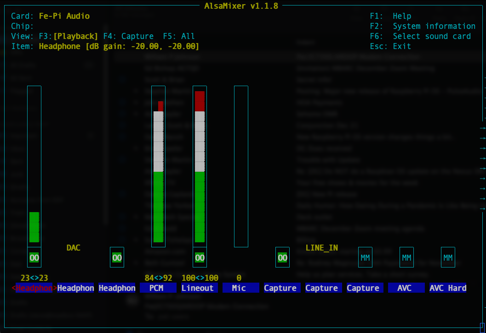

# Preparing a New Nexus Image

Many of these OS preparation tips are from David Ranch's excellent [HOWTO](http://www.trinityos.com/HAM/CentosDigitalModes/RPi/rpi4-setup.html).

1) Download the "Raspbian Pi OS with desktop" [image](https://www.raspberrypi.org/software/operating-systems/) and burn it to an SD card.

1) Boot the SD card in the Pi.

1) Follow prompts and provide the requested settings.  
	
1) Reboot when prompted.

1) Run __Raspberry > Preferences > Raspberry Pi Configuration__
	- Click __Change Password...__ and set pasword to `changeme`.
	- Change hostname to 'nexus'
	- In __Interfaces__ tab, enable SSH, VNC, SPI, I2C, Serial Port

1) Terminal settings

	- Open a Terminal window
	- Click __Edit > Preferences__.
	- Change Terminal font to Monospace Regular 14
	- Change Display scrollbak lines to 100000
	- Change Display window size to 100 x 30
	- Click __OK__
	- Close and re-open Terminal to test

1) Reboot

1) Change password to `changeme` if prompted

1) Disable NFS clients

		sudo systemctl disable nfs-client.target

1) Bring it up to date

		sudo apt-get clean
		sudo apt-get update
		sudo apt-get autoremove
		sudo apt-get upgrade	
		sudo apt-get dist-upgrade

1) Check eeprom state

		sudo rpi-eeprom-update
		
	If this returns something other than __up-to-date__ for BOOTLOADER and VL805, then run this command followed by a reboot:
	
		sudo rpi-eeprom-update -a
		
1) Get script to remove old kernels

		cd /tmp
		wget http://www.trinityos.com/HAM/CentosDigitalModes/RPi/usr/local/sbin/remove-old-kernels.sh
		sudo mv /tmp/remove-old-kernels.sh /usr/local/sbin/
		sudo chmod 700 /usr/local/sbin/remove-old-kernels.sh
		sudo /usr/local/sbin/remove-old-kernels.sh

1) Install persistent iptables:

		sudo apt-get install iptables-persistent
		
1) Edit `/etc/apt/sources.list` and enable `deb-src`:	

	- Uncomment the line starting with `#deb-src` so it looks like:
	
			deb-src http://raspbian.raspberrypi.org/raspbian/ buster main contrib non-free rpi
	- Save and close the file
			
1) Install the toolchains and packages:

		sudo apt-get install vim tcpdump lsof gpm telnet minicom links exfat-utils \
		yad dosfstools xscreensaver build-essential autoconf automake libtool cmake \
		extra-xdg-menus bc dnsutils libgtk-3-bin jq xdotool moreutils build-essential \
		aptitude
		sudo apt update
	
1) Set `vim` or `nano` as system default text editor:

		sudo update-alternatives --set editor /usr/bin/vim.basic
		
	or, run `select-editor` to change it to nano.
		
1) Add these 2 lines to `/etc/fstab`:

		tmpfs           /tmp            tmpfs   defaults,noatime,mode=1777,size=50m   0   0
		tmpfs           /var/log        tmpfs   defaults,noatime,mode=0755,size=50m  0   0
		
	Save and reboot.
	
1) Install USB drive power management

		sudo apt-get install hdparm
	
1) Disable the special key keyboard mapping tool

		sudo update-rc.d -f triggerhappy remove
		sudo systemctl disable triggerhappy.service
		sudo systemctl disable triggerhappy.socket
		
1) `/etc/rsyslog.conf` changes:

	- Delete this stanza:

			*.=debug;\
				auth,authpriv.none;\
				news.none;mail.none     -/var/log/debug
			
	- Find this line:
	
			*.*;auth,authpriv.none        -/var/log/syslog
		and change it to:
			
			*.*;auth,authpriv,mail.none        -/var/log/syslog
	- Delete these lines:

            mail.info                     -/var/log/mail.info
            mail.warn                     -/var/log/mail.warn
            
   - Change the line:
   
   			mail.err                      /var/log/mail.err
		to:
   			
   			mail.warn                     /var/log/mail.err
   			
   - Find the line:
   
   			kern.*                        -/var/log/kern.log
   			
		and insert a new line with this text right after:	

			kern.debug                    stop
			
	- Save these changes then restart rsyslog:
	
			sudo systemctl restart rsyslog
			
	- Remove the old debug logs:
	
			sudo rm -f /var/log/debug*
			
1) Add ULOG for iptables logging to separate file

	- Install ulogd2:
	
			sudo apt-get install ulogd2
			
	- Edit `/etc/ulogd.conf` and modify the following stanzas to look like this:
	
			[log1]
			group=0

			[log2]
     		group=1

     		[emu1]
     		file="/var/log/ulogd_traffic-emu1.log"
     		sync=1

     		[emu2]
     		file="/var/log/ulogd_traffic-emu2.log"
     		sync=1

	- Restart ulogd:
	
			sudo systemctl restart ulogd

1) Modify log management

	- Open `/etc/logrotate.conf` and change:
		
			#compress
		to:
		
			compress

	- Add these lines immediately after `compress`:
	
			# use bzip2 with higher compression than gzip
			compresscmd /bin/bzip2
			uncompresscmd /bin/bunzip2
			compressoptions -9
			compressext .bz2
	- Save and close the file.
	
	- Edit `/etc/logrotate.d/rsyslog` and comment out all `delaycompress` lines.
	
	- Add these lines to the TOP of the file, not part of any stanza:
	
			rotate 3
			daily
			missingok
			notifempty
			compress
			compresscmd /bin/bzip2
			uncompresscmd /bin/bunzip2
			compressoptions -9
			compressext .bz2
	- Save and close the file.
	
	- Edit `/etc/logrotate.d/ulogd2` and add the following stanza:
	
			/var/log/ulogd_traffic-emu1.log
			{
         		rotate 4
            	weekly
            	missingok
            	notifempty
            	size 10M
            	compress
	    			compresscmd /bin/bzip2
	    			uncompresscmd /bin/bunzip2
	    			compressoptions -9
	    			compressext .bz2
            	sharedscripts
            	create 640 ulog adm
            	postrotate
               	invoke-rc.d ulogd2 reload > /dev/null
            	endscript
			}

1) Enable Hardware Watchdog

	- Install `watchdog`:
	
			sudo apt-get install watchdog
		
		
	- Edit `/etc/watchdog.conf` and uncomment these lines:
	
			max-load-1             = 24
			max-load-5             = 18
			watchdog-device        = /dev/watchdog

	- Enable and start `watchdog`:
	
			sudo systemctl enable watchdog
			sudo systemctl start watchdog.service

1) Changes to `/boot/config.txt`

	- Uncomment this line:
	
			hdmi_force_hotplug=1
	
1) Set resolution

	- Run `sudo raspi-config`
	- Select __1 Display Options__, then __D1 Resolution__, then select __DMT Mode 82__ from the list.
	- Tab to OK, then exit `raspi-config`.
	

## __SAVE THE IMAGE NOW AS A NEXUS-CANDIDATE!__

1) Reboot

1) Install `nexus-initialize` files and scripts and run initializer

		sudo mkdir -p /usr/local/src/nexus
		sudo chown $USER:$USER /usr/local/src/nexus
		cd /usr/local/src/nexus
		git clone https://github.com/AG7GN/nexus-initialize
		nexus-initialize/nexus-install -f
	
	The `nexus-install` command will delete `$HOME/DO_NOT_DELETE_THIS_FILE`, which will cause initialize-pi.sh to run at next boot. `initialize-pi.sh` will clear out user's home folder and other personal data from some apps.
	
1) Click __Raspberry > Preferences > Main Menu editor__ and arrange menu to suit.

1) Try connecting to the Pi from a VNC client

	- Should be able to go to `nexus.local`
	
	- Once connected, run __Raspberry > Preferences > Screensaver__, then select __Disable Screen Saver__ in the dropdown.
	- __File > Quit__ to exit __Screensaver__
	
1) Set resolution from VNC

	- Run __Raspberry > Preferences > Screen Configuration__. 
	- Select __Configure > Screens > HDMI-1 > Resolution > 1920 x 1080.
	- Click OK to accept setting.
	- __File > Quit__ to exit __Screen Configuration__
	
1) Reboot and test VNC again.

1) Open `alsamixer` and verify that the Fe-Pi capture is set to __LINE_IN__ and that the capture attenuation is on (not muted) and that line out is not muted and set to 100. as shown:

The settings offscreen to the right are at default values.  Note that the values shown are just a starting point. Some fine tuning may be needed.

1) Set version (update date as needed)

		echo "NEXUS_VERSION=20201209" | sudo tee /boot/nexus.txt 1>/dev/null
		
1) Remove `$HOME/DO_NOT_DELETE_THIS_FILE` and shutdown (don't reboot).

Image is now ready for distribution
